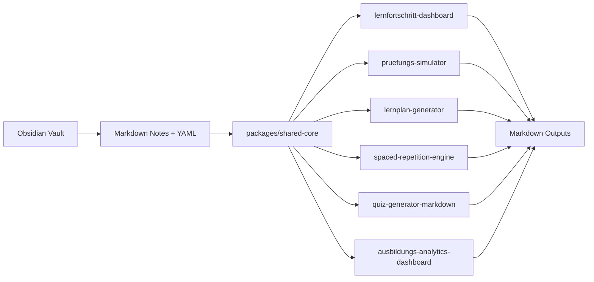
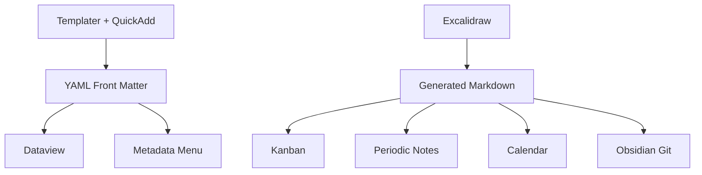

# Obsidian Ausbildung Plugins

> Work in progress (WIP): the repository is under active development. Interfaces, plugin scope, and release status may still change.

Obsidian plugins for structured learning workflows, exam preparation, and progress tracking.

The repository bundles several standalone plugins that share a small common core and the same front matter conventions.

## What is in this repo

This is a monorepo with several standalone Obsidian plugins. Each plugin can be built and released on its own, but they share a common data model and a small shared core.



The repository includes:

- plugin code
- shared logic and tests
- CI setup
- a synthetic `test-vault` for reproducible QA
- onboarding docs, note templates, and a vault bootstrap script
- install and packaging helpers for local vault use and GitHub releases

What it does not include:

- private vault content
- personal learning notes
- scraped training data

The example vault is intentionally small and artificial. It exists for reproducible tests and screenshots.

## What the project feels like right now

The repo is still a mono-repo full of separate plugins, but the intended entry point is no longer "figure out which command to run".

The dashboard plugin now acts as a small learner-first hub:

- it checks what is due
- it points at weak modules
- it looks at the currently open note and decides whether quiz or exam generation makes sense
- it lets you jump straight into `Review Queue`, `Quiz`, `Prüfung`, or `Lernplan`

That shift matters. For actual studying, "what should I do next?" is the real question. The repo is finally starting to answer that directly.

## Shared foundation

All plugins in the repo work against the same file-based learning model:

- markdown notes as the primary source
- YAML front matter for status, review, scoring, and relevance
- generated markdown outputs instead of hidden proprietary storage
- optional AI features through BYOK provider settings


Each plugin keeps a local fallback path. If AI is disabled, a key is missing, or a provider request fails, the plugin should still remain usable.

## Obsidian stack

These plugins are designed to work alongside an existing Obsidian setup.

- `Dataview` is treated as the preferred live layer, but never as a hard runtime requirement.
- `Periodic Notes` is supported as a target for review queues and day-level study planning.
- `Metadata Menu` fits naturally because the plugins stay YAML-first.
- `Kanban`, `Calendar`, `Templater`, `Buttons`, `QuickAdd`, `Database Folder`, and `Obsidian Git` all remain useful around the edges because the outputs are ordinary markdown files and normal front matter.
- `Excalidraw` stays complementary. The plugins do not try to own diagramming or visual thinking.

Optional integrations stay optional. The plugins start and run without hard dependencies on other community plugins.



## Current plugins

### Stable Tier 1

These are the most advanced plugins in the repository, but the repository as a whole is still WIP.

- `lernfortschritt-dashboard` now doubles as the central learner-facing hub
- `pruefungs-simulator`
- `lernplan-generator`

### Experimental

- `spaced-repetition-engine`
- `quiz-generator-markdown`
- `ausbildungs-analytics-dashboard`

Experimental means the plugin is usable, but not yet held to the same release confidence as Tier 1.

These plugins now also include preview flows and BYOK-aware settings, but they should still be treated as WIP until they have seen more manual vault testing.

## Quality bar

Each plugin is expected to have:

- a clean TypeScript build
- tested core logic
- a manual QA path against the synthetic vault
- a sensible fallback when optional plugins like `Dataview` are not present
- usable settings and preview flows for any feature that writes large outputs

## Local development

Install everything once:

```bash
npm install
npm run check
```

Build one plugin on its own:

```bash
npm run build --workspace lernfortschritt-dashboard
```

Useful repo helpers:

```bash
python3 scripts/install_plugin.py --help
python3 scripts/bootstrap_vault.py --help
python3 scripts/package_releases.py
```

For manual QA, use the test vault and verify the resulting markdown inside Obsidian.

For day-to-day vault testing, the dashboard ribbon is the best first click. That is where the repo now ties note quality, review pressure, quiz readiness, and weak modules together.

For AI-backed features, also verify:

- provider connection test
- visible connection status in settings
- graceful fallback when the key is removed or the provider is unavailable

## User onboarding

For a real user workflow, start here:

- [docs/getting-started.md](/Users/p2plus/Library/CloudStorage/GoogleDrive-philipp.rudics@gmail.com/Meine%20Ablage/Vault/obsidian-ausbildung-plugins/docs/getting-started.md)
- [docs/vault-onboarding.md](/Users/p2plus/Library/CloudStorage/GoogleDrive-philipp.rudics@gmail.com/Meine%20Ablage/Vault/obsidian-ausbildung-plugins/docs/vault-onboarding.md)
- [docs/tools-and-prompts.md](/Users/p2plus/Library/CloudStorage/GoogleDrive-philipp.rudics@gmail.com/Meine%20Ablage/Vault/obsidian-ausbildung-plugins/docs/tools-and-prompts.md)
- [docs/templater-and-quickadd.md](/Users/p2plus/Library/CloudStorage/GoogleDrive-philipp.rudics@gmail.com/Meine%20Ablage/Vault/obsidian-ausbildung-plugins/docs/templater-and-quickadd.md)

Included helpers:

- note templates in [templates](/Users/p2plus/Library/CloudStorage/GoogleDrive-philipp.rudics@gmail.com/Meine%20Ablage/Vault/obsidian-ausbildung-plugins/templates)
- importable Templater and QuickAdd snippets in [integrations](/Users/p2plus/Library/CloudStorage/GoogleDrive-philipp.rudics@gmail.com/Meine%20Ablage/Vault/obsidian-ausbildung-plugins/integrations)
- a local install helper in [scripts/install_plugin.py](/Users/p2plus/Library/CloudStorage/GoogleDrive-philipp.rudics@gmail.com/Meine%20Ablage/Vault/obsidian-ausbildung-plugins/scripts/install_plugin.py)
- a bootstrap script in [scripts/bootstrap_vault.py](/Users/p2plus/Library/CloudStorage/GoogleDrive-philipp.rudics@gmail.com/Meine%20Ablage/Vault/obsidian-ausbildung-plugins/scripts/bootstrap_vault.py)
- a release packager in [scripts/package_releases.py](/Users/p2plus/Library/CloudStorage/GoogleDrive-philipp.rudics@gmail.com/Meine%20Ablage/Vault/obsidian-ausbildung-plugins/scripts/package_releases.py)

## Maintainer docs

For the repo side of the project:

- [docs/roadmap.md](/Users/p2plus/Library/CloudStorage/GoogleDrive-philipp.rudics@gmail.com/Meine%20Ablage/Vault/obsidian-ausbildung-plugins/docs/roadmap.md)
- [docs/community-release-checklist.md](/Users/p2plus/Library/CloudStorage/GoogleDrive-philipp.rudics@gmail.com/Meine%20Ablage/Vault/obsidian-ausbildung-plugins/docs/community-release-checklist.md)
