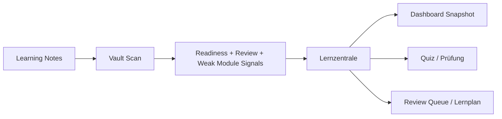

# Lernfortschritt Dashboard

> Status: WIP. Usable, but still under active development.

`lernfortschritt-dashboard` is no longer just a snapshot writer. It now acts as the learner-facing entry point for the stack: what is due, what is weak, whether the current note is usable for quizzes, and which next step makes sense today.

The plugin is intentionally file-based: plain markdown in, plain markdown out, and no hard dependency on `Dataview`.

## What it does well

- gives you a proper `Lernzentrale` instead of just another report button
- includes a built-in `Vault Doctor` for rough edges in metadata, review dates, and note structure
- counts progress by `lernstatus` and `ausbildungsjahr`
- highlights weak modules based on recorded scores
- shows due reviews without forcing a separate review system
- checks whether the active note is structured enough for local quiz and exam generation
- lets you update the current note's `lernstatus` quickly from inside Obsidian

## Integration

- strong match with `Dataview`
- clean front matter for `Metadata Menu`
- generated outputs can be turned into boards with `Kanban`

## How people actually use it

- click the ribbon icon to open the `Lernzentrale`
- start with the recommended next action instead of guessing which plugin to open
- use the current-note panel to see whether the open note is quiz-ready or still too raw
- drop into `Quiz`, `Prüfung`, `Review Queue`, or `Lernplan` directly from there
- run `Vault Doctor` when a vault feels noisy, inconsistent, or oddly unhelpful

## Manual QA

- activate the plugin in a clean test vault
- click the dashboard ribbon icon and verify the `Lernzentrale` opens
- open a real learning note and confirm the current-note panel reacts to it
- trigger `Review Queue`, `Quiz`, and `Lernplan` from the dashboard modal
- open `Vault Doctor` and verify that obvious metadata gaps are called out
- run `Dashboard: Snapshot generieren`
- open the generated file and verify totals, years, and weak modules
- run `Dashboard: Aktuelle Notiz als geuebt markieren`
- restart Obsidian and confirm the YAML change persisted cleanly
