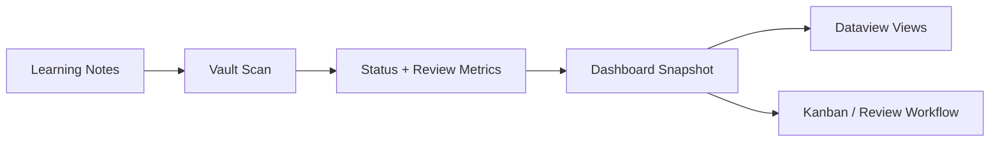

# Lernfortschritt Dashboard

`lernfortschritt-dashboard` scans learning notes, reads existing front matter, and writes a compact progress snapshot for the vault.

The plugin is intentionally file-based: plain markdown in, plain markdown out, and no hard dependency on `Dataview`.

## What it does well

- counts progress by `lernstatus` and `ausbildungsjahr`
- highlights weak modules based on recorded scores
- shows due reviews without forcing a separate review system
- lets you update the current note's `lernstatus` quickly from inside Obsidian

## Integration

- strong match with `Dataview`
- clean front matter for `Metadata Menu`
- generated outputs can be turned into boards with `Kanban`

## Manual QA

- activate the plugin in a clean test vault
- run `Dashboard: Snapshot generieren`
- open the generated file and verify totals, years, and weak modules
- run `Dashboard: Aktuelle Notiz als geuebt markieren`
- restart Obsidian and confirm the YAML change persisted cleanly
